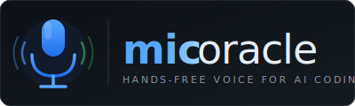
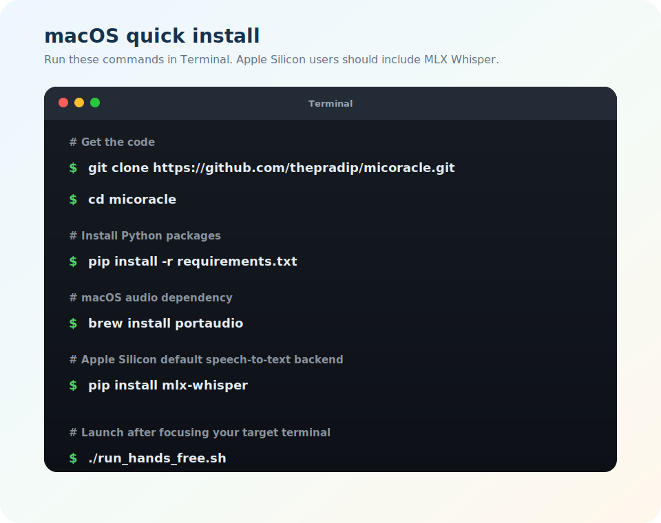
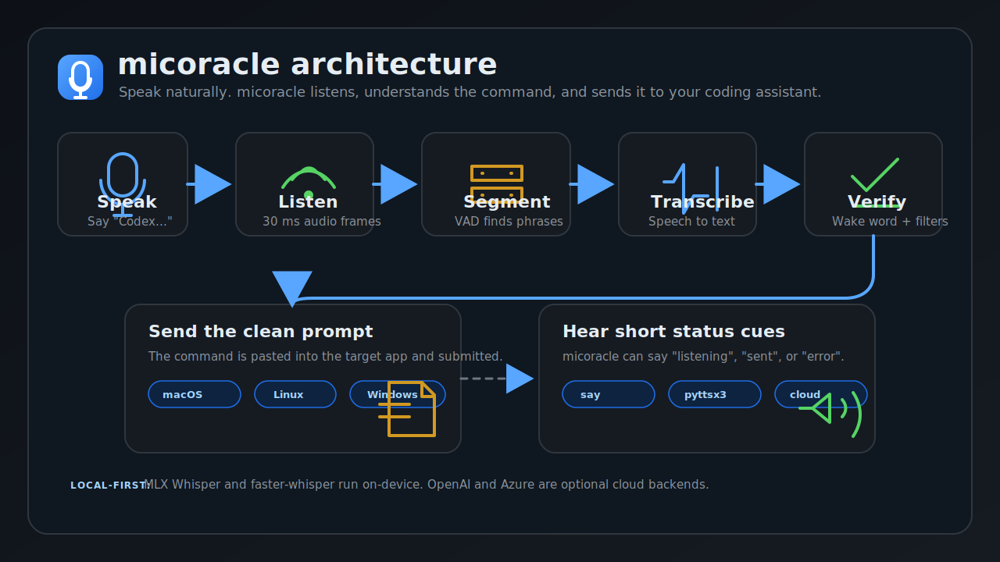

<div align="center">



### Stop typing your AI prompts. Just say them.

**Hands-free voice input for Claude Code, Codex CLI, and any terminal macOS · Linux · Windows**

Say *"Codex, refactor this function"* → transcribed → pasted into your terminal → Enter pressed. No push-to-talk. No cloud required.

[](https://pypi.org/project/micoracle/)
[](https://pypi.org/project/micoracle/)
[](./LICENSE)
[](https://www.python.org/)
[](https://www.apple.com/macos/)
[](https://www.linux.org/)
[](https://www.microsoft.com/windows)

</div>

---

## Demo

https://github.com/user-attachments/assets/8ab4fc80-8557-4b4e-9149-d6dfad434f70

---

## Quick Install

```bash
git clone https://github.com/thepradip/micoracle.git
cd micoracle
pip install -r requirements.txt
```

Then pick your platform and run:

```bash
./run_hands_free.sh        # macOS / Linux
run_hands_free.bat         # Windows
```


> **Need a specific STT backend?** Jump to the [full install guide](#install) below.

---

## Why micoracle?

| Without micoracle | With micoracle |
|---|---|
| Stop → think → type prompt → Enter | Say the prompt. Done. |
| Push-to-talk or browser extension | Always-on wake-word listener |
| Cloud-only transcription | 100% offline on Apple Silicon & CPU |
| Locked to one tool | Works with any terminal app |

Works with **[Claude Code](https://claude.ai/code)** · **[OpenAI Codex CLI](https://github.com/openai/codex)** · **[OpenCode](https://github.com/sst/opencode)** · **iTerm2 · Warp · VS Code terminal · Windows Terminal**

---

## Features

| | Feature | Detail |
|---|---|---|
| 🌐 | **Cross-platform** | Auto-selects macOS (AppleScript), Linux (xdotool / wtype), or Windows (pywin32 + pyautogui) |
| 🎙️ | **4 STT backends** | MLX Whisper · faster-whisper · OpenAI · Azure |
| 🔊 | **4 TTS backends** | macOS `say` · pyttsx3 · OpenAI TTS · Azure Speech TTS |
| 🔉 | **Continuous listening** | WebRTC VAD + 300 ms preroll buffer — wake words are never clipped at onset |
| 💬 | **Wake-word gate** | `"Claude, …"` / `"Codex, …"` with fuzzy mishear tolerance |
| ⏱️ | **Two-step follow-up** | Say wake word alone → hear *"listening"* → speak prompt within 8 s |
| 🚫 | **Hallucination filter** | Whisper artifacts like *"Thank you."* / *"Amen."* silently dropped |
| 🔒 | **Target-aware dispatch** | macOS / Windows reactivate the startup target; Linux dispatches to focused window |
| 📋 | **Clipboard-conscious** | Original clipboard contents restored immediately after each dispatch |

---

## Platform & Backend Matrix

| Platform | STT default | TTS default | Focus & paste method | Notes |
|---|---|---|---|---|
| macOS (Apple Silicon) | `mlx` | `say` | AppleScript | Lowest local latency |
| macOS (Intel) | `faster` | `say` | AppleScript | |
| Linux X11 | `faster` | `pyttsx3` | `xdotool type` | Keep target window focused |
| Linux Wayland | `faster` | `pyttsx3` | `wtype` + `wl-copy` | `--target-app` required |
| Windows 10/11 | `faster` | `pyttsx3` | pywin32 + pyautogui | Extra pip packages required |

---

## Install



### Step 1 — Core dependencies (all platforms)

```bash
git clone https://github.com/thepradip/micoracle.git
cd micoracle
pip install -r requirements.txt
```

### Step 2 — Pick an STT backend

| Backend | Best for | Install |
|---|---|---|
| `mlx` | Apple Silicon (fastest local) | `pip install mlx-whisper` |
| `faster` | Cross-platform local CPU | `pip install faster-whisper` |
| `openai` | Cloud (OpenAI Whisper API) | `pip install openai` |
| `azure` | Cloud (Azure OpenAI Whisper) | `pip install openai` + set Azure env vars |

### Step 3 — Pick a TTS backend _(optional)_

| Backend | Best for | Install |
|---|---|---|
| `say` | macOS (built-in) | nothing |
| `pyttsx3` | Linux / Windows offline | `pip install pyttsx3` + `sudo apt install espeak` |
| `openai` | Cloud (OpenAI TTS) | `pip install openai` |
| `azure` | Cloud (Azure Speech) | set Azure Speech env vars |

### Step 4 — Platform-specific system packages

**macOS (Apple Silicon):**
```bash
brew install portaudio
pip install mlx-whisper
```

**macOS (Intel):**
```bash
brew install portaudio
pip install faster-whisper
```

**Linux (X11):**
```bash
sudo apt install xdotool portaudio19-dev python3-dev
pip install faster-whisper
```

**Linux (Wayland):**
```bash
sudo apt install wtype wl-clipboard portaudio19-dev python3-dev
pip install faster-whisper
```

**Windows:**
```bash
pip install pyperclip pyautogui pywin32 psutil faster-whisper
```

### Step 5 — Configure

```bash
cp .env.example .env
# Set API keys if using cloud backends; adjust default backends and target app
```

---

## Quickstart

```bash
# Focus Claude Code, Codex CLI, or any terminal — then launch:
./run_hands_free.sh          # macOS / Linux
run_hands_free.bat           # Windows
```

**One-shot:** *"Codex, write a Python hello world."* → pasted with Enter.

**Two-step:** *"Codex."* → hear *"listening"* → say prompt within 8 s → pasted.

**Override backends at launch:**
```bash
./run_hands_free.sh --stt-backend openai --tts-backend openai
```

**Pin to a specific app (required on Wayland):**
```bash
./run_hands_free.sh --target-app gnome-terminal
```

---

## CLI Reference

| Flag | Default | Description |
|---|---|---|
| `--device <id\|name>` | system default mic | Audio input device |
| `--list-devices` | — | Print available input devices and exit |
| `--target-app <name>` | frontmost app at startup | Lock the dispatch target |
| `--stt-backend` | `auto` | `auto` / `mlx` / `faster` / `openai` / `azure` |
| `--tts-backend` | `auto` | `auto` / `say` / `pyttsx3` / `openai` / `azure` / `none` |
| `--no-speak` | — | Alias for `--tts-backend none` |

---

## Environment Variables

See [`.env.example`](./.env.example) for the full commented list.

| Variable | Purpose |
|---|---|
| `VOICE_AGENT_STT_BACKEND` | Default STT backend (`auto` / `mlx` / `faster` / `openai` / `azure`) |
| `VOICE_AGENT_TTS_BACKEND` | Default TTS backend (`auto` / `say` / `pyttsx3` / `openai` / `azure` / `none`) |
| `VOICE_AGENT_TARGET_APP` | Default dispatch target app name |
| `VOICE_AGENT_INPUT_DEVICE` | Default microphone device (name fragment or numeric id) |
| `VOICE_AGENT_MLX_REPO` | MLX Whisper HuggingFace repo (Apple Silicon) |
| `VOICE_AGENT_FASTER_MODEL` | faster-whisper model (`tiny.en` / `base.en` / `small.en` / `medium.en` / `large-v3`) |
| `VOICE_AGENT_FASTER_DEVICE` | faster-whisper device (`auto` / `cpu` / `cuda`) |
| `VOICE_AGENT_FASTER_COMPUTE` | faster-whisper compute type (`int8` / `float16` / `int8_float16`) |
| `VOICE_AGENT_TTS_VOICE` | macOS `say` voice name (e.g. `Samantha`) |
| `VOICE_AGENT_OPENAI_STT_MODEL` | OpenAI STT model name (default: `whisper-1`) |
| `VOICE_AGENT_OPENAI_TTS_VOICE` | OpenAI TTS voice (`alloy` / `echo` / `fable` / `onyx` / `nova` / `shimmer`) |
| `VOICE_AGENT_AZURE_TTS_VOICE` | Azure Speech TTS voice (default: `en-US-AriaNeural`) |
| `HF_HUB_ENABLE_HF_TRANSFER` | Set to `1` for faster HuggingFace model downloads |
| `OPENAI_API_KEY` | OpenAI STT / TTS backends |
| `AZURE_OPENAI_ENDPOINT` | Azure OpenAI Whisper endpoint |
| `AZURE_OPENAI_KEY` | Azure OpenAI key |
| `AZURE_WHISPER_DEPLOYMENT` | Azure Whisper deployment name (default: `whisper`) |
| `AZURE_SPEECH_KEY` | Azure Speech TTS key |
| `AZURE_SPEECH_REGION` | Azure Speech TTS region (e.g. `eastus`) |

---

## Architecture




### How it works

1. **You speak a command** — e.g. *"Codex, refactor this function"*
2. **micoracle listens for real speech** — background noise is ignored via WebRTC VAD
3. **Audio is transcribed** — using local or cloud STT backend
4. **Wake word is checked** — only commands starting with `Claude` or `Codex` pass
5. **Clean prompt is sent** — pasted into the target app, Enter pressed
6. **Status cue plays** — e.g. *"listening"*, *"sent"*, or *"error"*

### Module overview

| Module | Responsibility |
|---|---|
| `hands_free_voice.py` | Main entry point — mic capture, VAD wiring, wake-word gate, dispatch loop |
| `segmenter.py` | `VADSegmenter` — frame-by-frame VAD state machine, preroll ring buffer |
| `stt.py` | `STTBackend` ABC + 4 implementations + OS-aware auto factory |
| `tts.py` | `TTSBackend` ABC + 4 implementations + auto factory |
| `platform_adapter.py` | `MacAdapter` / `LinuxAdapter` / `WindowsAdapter` + factory |

### VAD state machine

```
IDLE ──(speech frames ≥ 4)──▶ CAPTURING ──(silence ≥ 840 ms OR 18 s cap)──▶ EMIT utterance ──▶ IDLE
 ▲                                 │
 └──(speech_run decays on silence)─┘
```

---

## Troubleshooting

**No input devices shown.**
Grant microphone permission to your terminal. macOS: *Privacy & Security → Microphone*. Linux: check PulseAudio / PipeWire. Windows: *Settings → Privacy → Microphone*.

**Wake word never fires.**
Confirm the right mic with `--list-devices`. Say *"Codex"* slowly — fuzzy matching covers mishears, but low mic gain can strip initial consonants.

**`[dispatch error]` on Wayland.**
Wayland blocks programmatic window focus. Pass `--target-app <name>` and keep that window focused manually.

**Windows: keystrokes go to the wrong window.**
Focus-stealing prevention can block `SetForegroundWindow`. Give the target window focus manually before speaking, or use AutoHotkey.

**macOS: keystrokes ignored.**
Accessibility + Automation permissions missing. *System Settings → Privacy & Security → Accessibility / Automation*.

---

## Privacy & Security

- **Local backends are fully on-device** — MLX Whisper and faster-whisper make zero network calls
- **Cloud backends upload audio** (OpenAI, Azure) — use only if comfortable
- **Clipboard temporarily overwritten** per dispatch — original contents restored immediately
- **No telemetry. No analytics. No phone-home.**
- **Accessibility permissions are powerful** — review the source before granting

---

## Future Scope

- **Additional STT backends:** ElevenLabs Scribe and Google Gemini cloud transcription
- **Stronger Linux target locking:** closer to macOS / Windows target reactivation behaviour
- **Packaged installers:** smoother setup with platform-specific dependency checks
- **Tray / menu bar control:** pause, resume, backend selection, target status
- **Custom wake words:** beyond `Claude` and `Codex`
- **Command history:** optional local log of recent accepted prompts

---

## Related searches

*voice input for Claude Code · speech to text for terminal · hands-free coding assistant · talk to Codex CLI · whisper voice paste terminal · dictate to terminal macOS Linux Windows · offline speech recognition CLI · voice control AI coding tool · Claude Code voice · Codex CLI voice input · AI terminal voice control*

---

## License

[MIT](./LICENSE) © 2026 Pradip Tivhale

---

## Acknowledgements

- [MLX Whisper](https://github.com/ml-explore/mlx-examples) · [faster-whisper](https://github.com/SYSTRAN/faster-whisper) · [py-webrtcvad](https://github.com/wiseman/py-webrtcvad)
- [sounddevice](https://python-sounddevice.readthedocs.io/) · [soundfile](https://python-soundfile.readthedocs.io/)
- [xdotool](https://github.com/jordansissel/xdotool) · [wtype](https://github.com/atx/wtype) · [pyautogui](https://pyautogui.readthedocs.io/)
- [pyttsx3](https://pyttsx3.readthedocs.io/)
