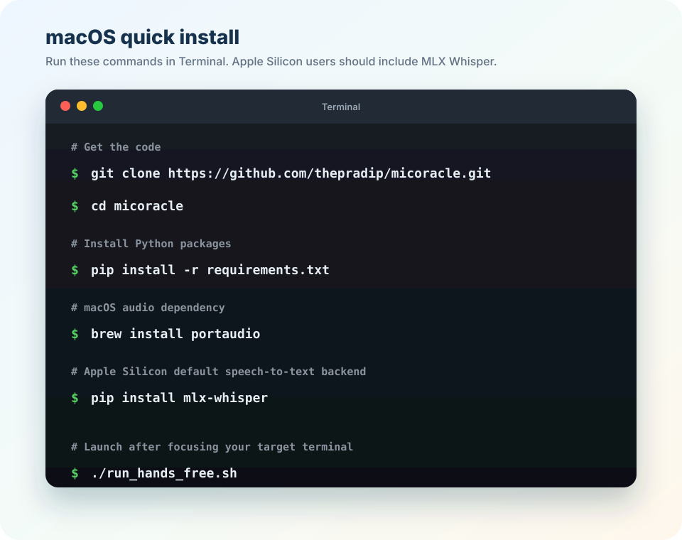
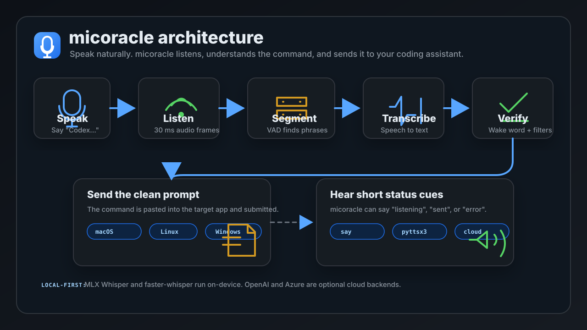

<div align="center">


### Talk to your computer. It talks back — and gets things done.

**A hands-free voice assistant that dictates into any terminal, browses the web, runs coding agents, and verifies its own work — macOS · Linux · Windows**

Say *"Claude, refactor this function"* → typed into your terminal, Enter pressed.
Say *"Micoracle, open hacker news and read me the top headlines"* → a real browser opens, scrapes the page, and the answer is **spoken back to you**. No push-to-talk. No cloud required. No API keys required.

[](https://pypi.org/project/micoracle/)
[](https://pypi.org/project/micoracle/)
[](./LICENSE)
[](https://www.python.org/)
[](https://www.apple.com/macos/)
[](https://www.linux.org/)
[](https://www.microsoft.com/windows)

</div>

---

## Demo

https://github.com/user-attachments/assets/8ab4fc80-8557-4b4e-9149-d6dfad434f70

---

## Quick Install

```bash
git clone https://github.com/thepradip/micoracle.git
cd micoracle
pip install -r requirements.txt
```

Then pick your platform and run:

```bash
./run_hands_free.sh        # macOS / Linux
run_hands_free.bat         # Windows
```

> **Need a specific STT backend?** Jump to the [full install guide](#install) below.

---

## Why micoracle?

| Without micoracle | With micoracle |
|---|---|
| Stop → think → type prompt → Enter | Say the prompt. Done. |
| Push-to-talk or browser extension | Always-on wake-word listener |
| Cloud-only transcription | 100% offline on Apple Silicon & CPU |
| Locked to one tool | Works with any terminal app |
| An assistant that *claims* it did something | An agent that **proves** it — every action verified with evidence |
| Pay-per-token API keys | Runs on your existing ChatGPT login via the codex CLI — zero keys |

Works with **[Claude Code](https://claude.ai/code)** · **[OpenAI Codex CLI](https://github.com/openai/codex)** · **[OpenCode](https://github.com/sst/opencode)** · **iTerm2 · Warp · VS Code terminal · Windows Terminal**

---

## Features

| | Feature | Detail |
|---|---|---|
| 🌐 | **Cross-platform** | Auto-selects macOS (AppleScript), Linux (xdotool / wtype), or Windows (pywin32 + pyautogui) |
| 🎙️ | **10 STT backends** | MLX Whisper · faster-whisper · OpenAI · Azure · OpenAI Realtime · 60dB · ElevenLabs · Deepgram · AssemblyAI · Groq · Gladia |
| 🔊 | **4 TTS backends** | macOS `say` · pyttsx3 · OpenAI TTS · Azure Speech TTS |
| 🔉 | **Continuous listening** | WebRTC VAD + 300 ms preroll buffer — wake words are never clipped at onset |
| 💬 | **Wake-word gate** | `"Claude, …"` / `"Codex, …"` / `"Micoracle, …"` with fuzzy mishear tolerance |
| ⏱️ | **Two-step follow-up** | Say wake word alone → hear *"listening"* → speak prompt within 8 s |
| 💰 | **Cost-guard** | Cloud STT backends activate only after wake-word — continuous listening is always local & free |
| 🚫 | **Hallucination filter** | Whisper artifacts like *"Thank you."* / *"Amen."* silently dropped |
| 🔒 | **Target-aware dispatch** | macOS / Windows reactivate the startup target; Linux dispatches to focused window |
| 📋 | **Clipboard-conscious** | Original clipboard contents restored immediately after each dispatch |
| 🤖 | **Voice agent** | *"Micoracle, …"* drives a real browser, takes screenshots, delegates to Claude Code / Codex — and speaks results back |
| ✅ | **Evidence or it didn't happen** | The agent cannot claim success without proof: HTTP statuses, read-backs, exit codes, vision-checked screenshots |
| 🛡️ | **Spoken confirmation gate** | Buy / delete / send / submit actions wait for your spoken *"yes"* |
| 🗝️ | **Zero-key brain option** | GPT via your codex CLI login, or bring OpenAI / Anthropic / any OpenAI-compatible local model |

---

## STT Backends

### Local (free, offline)

| Backend | `--stt-backend` | Best for | Install |
|---|---|---|---|
| MLX Whisper | `mlx` | Apple Silicon — fastest on-device | `pip install "mlx-whisper" "numba>=0.65"` |
| faster-whisper | `faster` | Cross-platform CPU / CUDA | `pip install faster-whisper` |

### Cloud (post-wake-word only — never billed for continuous listening)

| Backend | `--command-stt-backend` | Latency | Extra install | Key env var |
|---|---|---|---|---|
| OpenAI Whisper | `openai` | ~1 s | `pip install openai` | `OPENAI_API_KEY` |
| Azure Whisper | `azure` | ~1 s | `pip install openai` | `AZURE_OPENAI_KEY` |
| OpenAI Realtime | `realtime` | ~600 ms | `pip install openai websockets` | `OPENAI_API_KEY` |
| 60dB.ai | `60db` | ~600 ms | _(none — stdlib only)_ | `SIXTYDB_API_KEY` |
| ElevenLabs Scribe | `elevenlabs` | ~400 ms | _(none — stdlib only)_ | `ELEVENLABS_API_KEY` |
| Deepgram Nova-2 | `deepgram` | ~250 ms | _(none — stdlib only)_ | `DEEPGRAM_API_KEY` |
| Groq Whisper | `groq` | ~200 ms | _(none — stdlib only)_ | `GROQ_API_KEY` |
| AssemblyAI | `assemblyai` | ~3–5 s | _(none — stdlib only)_ | `ASSEMBLYAI_API_KEY` |
| Gladia | `gladia` | ~3–5 s | _(none — stdlib only)_ | `GLADIA_API_KEY` |

**Cost-guard rule:** only `mlx`, `faster`, and `auto` are allowed for continuous listening. Any cloud backend set as `--stt-backend` is automatically demoted to `--command-stt-backend` and a local backend handles the mic stream instead.

---

## Wake Words

| Say | Example |
|---|---|
| `Claude, …` | *"Claude, explain this function"* (dictated into your terminal) |
| `Codex, …` | *"Codex, refactor to async"* (dictated into your terminal) |
| `Micoracle, …` | *"Micoracle, open hacker news and read me the top headlines"* (agent acts) |

All three support **fuzzy mishear tolerance** — common STT splits like *"Mic Oracle"*, *"Mick Oracle"*, *"meek oracle"*, *"Lord"* (for Claude) are all caught automatically.

**Two-step mode:** say the wake word alone → hear *"listening"* → speak your command within 8 s.

---

## The MicOracle Agent

Saying **"Micoracle, …"** doesn't type anything — it *does* things. Your words go through three layers, fastest first:

```
"Micoracle, take a screenshot"        →  instant offline action (~1 s, no LLM)
"Micoracle, open hacker news and      →  agent: LLM plans → tools act → result
 read me the top three headlines"        is verified → answer is spoken back
"Micoracle, what's the capital        →  plain spoken answer
 of France?"
```

**Layer 1 — instant actions** (offline, works with zero setup): screenshots, opening and focusing apps, opening URLs, web searches, typing text. On every OS.

**Layer 2 — the agent.** A tool-calling LLM that can:

- 🌐 **Drive a real browser** — navigate, click, fill forms, read pages, scrape data, screenshot (its own Chromium; your browser is untouched)
- 👀 **See your screen** — takes screenshots and actually looks at them (vision)
- 💻 **Delegate coding work** — runs **Claude Code** or **Codex** headlessly on real tasks and reports the outcome with exit codes
- 🗣️ **Talk it through** — asks a clarifying question out loud when your instruction is ambiguous; you answer by voice; say *"stop"* any time

**Layer 3 — honesty, enforced by code, not vibes:**

- The agent **cannot say "done" without evidence** — the loop rejects any success claim that isn't backed by an observed fact (final URL + HTTP status, an input read-back, a CLI exit code, a vision-checked screenshot).
- Destructive-sounding actions (**buy, delete, send, submit, pay…**) are held until you say *"yes"* out loud — a regex gate that runs whether or not the model flags them.
- If something fails, you hear exactly what failed and what was observed instead.

### Agent setup — pick your brain

**Option A: zero API keys** *(recommended if you already use the codex CLI)* — the agent runs GPT through your existing ChatGPT login:

```bash
pip install "micoracle[agent]"
playwright install chromium         # one-time browser download
# that's it — if `codex` is on your PATH, the brain just works
```

**Option B: API keys** — OpenAI or Anthropic, full native tool-calling:

```bash
export OPENAI_API_KEY=...           # or ANTHROPIC_API_KEY
export MICORACLE_PROVIDER=openai    # optional; auto-detected from keys
```

**Option C: open-source / self-hosted** — any OpenAI-compatible server (Ollama, llama.cpp, vLLM, LM Studio) whose model supports tool calling:

```bash
export OPENAI_BASE_URL=http://localhost:11434/v1
export OPENAI_API_KEY=local
export MICORACLE_AGENT_MODEL=qwen2.5:32b
```

The claude/codex delegation tools switch on automatically when those CLIs are on your PATH.

**Optional: external CDP browser engine** — point the agent's browser at any Chrome-DevTools-Protocol endpoint instead of launching Chromium, e.g. the ultra-light open-source [Lightpanda](https://lightpanda.io) (~9× faster, ~16× less RAM; currently Beta):

```bash
brew install lightpanda
lightpanda serve --host 127.0.0.1 --port 9222 &
export MICORACLE_BROWSER_CDP_URL=ws://127.0.0.1:9222
```

> Lightpanda doesn't render pixels: `browser_screenshot` reports itself unavailable and the agent verifies with `browser_read_page` instead. Keep the default Chromium for vision-verified or visually watched tasks.

### Conversation mode

One **"Micoracle, …"** opens a conversation — the mic stays hot and every following utterance is a command, no wake word needed:

> *"Micoracle, open hacker news."* → **"Opening."** → *"read me the top headline"* → **"Checking."** → *"search for that on google"* → **"Searching."** → *"stop"* → **"Stopped."**

- Commands spoken while the agent is busy **queue** (up to 5) and run in order — you hear *"Got it — after this one."*
- Commands in a conversation **share context**: "there", "it", "that page" resolve to earlier steps.
- End with *"stop"* / *"stop micoracle"* / *"micoracle stop"*, or just stay quiet — the session auto-ends after 2 minutes.
- The agent's own speech is echo-filtered so it never hears itself as a command.

---

## Real-World Use Cases

**🌅 The morning briefing** — while making coffee:
> *"Micoracle, open hacker news and read me the top three headlines."*
> The agent opens its browser, scrapes the front page, and reads them to you. Verified against the live page — it can't invent headlines, because the loop demands scraped evidence before it may answer.

**🧑‍💻 Hands-free pair programming** — your hands stay on one keyboard while agents work in another window:
> *"Claude, write unit tests for the parser module."* → dictated straight into Claude Code.
> *"Codex, run the test suite and fix what breaks."* → dictated into Codex.
> Pro tier: say *"Codex, ship it"* and a voice macro expands into your full review-and-commit prompt.

**🦾 Accessibility & RSI relief** — the whole flow works without touching the keyboard: dictation into any terminal, spoken answers back, apps opened and focused by voice. Local STT means it works offline, on a plane, with zero per-word cost.

**🔍 Voice-driven research** — mid-task, without switching windows:
> *"Micoracle, look up the Python 3.13 release notes and tell me what changed in asyncio."*
> The browser navigates, reads, and summarizes out loud while you keep coding.

**🤝 Delegate-and-forget coding tasks:**
> *"Micoracle, use codex to summarize the readme in this project."*
> *"Micoracle, ask claude to find and fix the failing test."*
> The agent runs the CLI headlessly, waits, and speaks the result — with the exit code as proof it actually ran.

**🖥️ "What am I looking at?"** — screen awareness on demand:
> *"Micoracle, take a screenshot and tell me what's on my screen."*
> The screenshot is saved to `~/Desktop/Screenshots/` and the model describes what it *actually sees* in the image.

**🛒 Safe web actions** — the confirmation gate in practice:
> *"Micoracle, fill the contact form with my name and submit it."*
> Filling happens (with read-back verification); the **submit click stops and asks you out loud** before anything irreversible happens. Say "no" and it stands down.

---

## Platform & Backend Matrix

| Platform | STT (listening) | TTS | Focus & paste | Screenshot | App launch/focus | Agent (browser + CLIs) |
|---|---|---|---|---|---|---|
| macOS Apple Silicon | `mlx` | `say` | AppleScript | `screencapture` | `open -a` / AppleScript | ✓ |
| macOS Intel | `faster` | `say` | AppleScript | `screencapture` | `open -a` / AppleScript | ✓ |
| Linux X11 | `faster` | `pyttsx3` | `xdotool type` | gnome-screenshot / scrot / import | `$PATH` / `gtk-launch` + `xdotool` | ✓ |
| Linux Wayland | `faster` | `pyttsx3` | `wtype` + `wl-copy` | `grim` / spectacle | `$PATH` / `gtk-launch` | ✓ |
| Windows 10/11 | `faster` | `pyttsx3` | pywin32 + pyautogui | PowerShell CopyFromScreen | `Start-Process` / AppActivate | ✓ |

The browser agent (Playwright) and the claude/codex delegation run identically on all three OSes; URLs and web searches use Python's stdlib `webbrowser` everywhere.

> Status note: the macOS column is verified end-to-end on real hardware (including live voice). The Linux and Windows action paths are implemented and unit-tested, but not yet live-tested — reports welcome.

---

## Install



### Step 1 — Core dependencies (all platforms)

```bash
git clone https://github.com/thepradip/micoracle.git
cd micoracle
pip install -r requirements.txt
```

### Step 2 — System packages

**macOS:**
```bash
brew install portaudio
```

**Linux (X11):**
```bash
sudo apt install xdotool portaudio19-dev python3-dev
```

**Linux (Wayland):**
```bash
sudo apt install wtype wl-clipboard portaudio19-dev python3-dev
```

### Step 3 — Pick a local STT backend (for continuous listening)

| Platform | Command |
|---|---|
| macOS Apple Silicon | `pip install "mlx-whisper" "numba>=0.65"` |
| macOS Intel / Linux / Windows | `pip install faster-whisper` |

### Step 4 — Pick a cloud STT backend (for commands, optional)

| Backend | Command | Notes |
|---|---|---|
| OpenAI Whisper | `pip install openai` | Set `OPENAI_API_KEY` |
| Azure Whisper | `pip install openai` | Set Azure env vars |
| OpenAI Realtime | `pip install openai websockets` | Set `OPENAI_API_KEY` |
| 60dB.ai | _(none)_ | Set `SIXTYDB_API_KEY` |
| ElevenLabs Scribe | _(none)_ | Set `ELEVENLABS_API_KEY` |
| Deepgram Nova | _(none)_ | Set `DEEPGRAM_API_KEY` |
| Groq Whisper | _(none)_ | Set `GROQ_API_KEY` |
| AssemblyAI | _(none)_ | Set `ASSEMBLYAI_API_KEY` |
| Gladia | _(none)_ | Set `GLADIA_API_KEY` |

### Step 5 — Pick a TTS backend _(optional, for status cues)_

| Backend | Best for | Install |
|---|---|---|
| `say` | macOS (built-in) | nothing |
| `pyttsx3` | Linux / Windows offline | `pip install pyttsx3` + `sudo apt install espeak` |
| `openai` | Cloud (OpenAI TTS) | `pip install openai` |
| `azure` | Cloud (Azure Speech) | set Azure Speech env vars |

### Step 6 — Windows dispatch packages

```bash
pip install pyperclip pyautogui pywin32 psutil
```

### Step 7 — Configure

```bash
cp .env.example .env
```

Recommended `.env` for Apple Silicon + 60dB commands:
```env
VOICE_AGENT_STT_BACKEND=mlx
VOICE_AGENT_COMMAND_STT_BACKEND=60db
SIXTYDB_API_KEY=sk_live_...
```

Recommended `.env` for Apple Silicon + Groq commands (fastest):
```env
VOICE_AGENT_STT_BACKEND=mlx
VOICE_AGENT_COMMAND_STT_BACKEND=groq
GROQ_API_KEY=gsk_...
```

---

## Quickstart

```bash
# Focus Claude Code, Codex CLI, or any terminal — then launch:
./run_hands_free.sh          # macOS / Linux
run_hands_free.bat           # Windows
```

**Dictate:** *"Claude, write a Python hello world."* → typed into the focused terminal, Enter pressed.

**Act:** *"Micoracle, take a screenshot."* → done in a second, saved to `~/Desktop/Screenshots/`, confirmed out loud.

**Agent:** *"Micoracle, open hacker news and read me the top three headlines."* → browser opens, page is scraped, headlines are spoken back (needs the [agent setup](#agent-setup--pick-your-brain)).

**Two-step:** say just the wake word → hear *"listening"* → speak within 8 s.

**Override backends at launch:**
```bash
./run_hands_free.sh --stt-backend mlx --command-stt-backend groq
```

**Pin to a specific app (required on Wayland):**
```bash
./run_hands_free.sh --target-app gnome-terminal
```

---

## CLI Reference

| Flag | Default | Description |
|---|---|---|
| `--device <id\|name>` | system default mic | Audio input device |
| `--list-devices` | — | Print available input devices and exit |
| `--target-app <name>` | frontmost app at startup | Lock the dispatch target |
| `--stt-backend` | `auto` | Local STT for continuous listening: `auto` / `mlx` / `faster` |
| `--command-stt-backend` | same as `--stt-backend` | Cloud STT for commands after wake-word: `openai` / `azure` / `realtime` / `60db` / `elevenlabs` / `deepgram` / `groq` / `assemblyai` / `gladia` |
| `--tts-backend` | `auto` | `auto` / `say` / `pyttsx3` / `openai` / `azure` / `none` |
| `--no-speak` | — | Alias for `--tts-backend none` |

---

## Environment Variables

See [`.env.example`](./.env.example) for the full commented list.

### Core

| Variable | Purpose |
|---|---|
| `VOICE_AGENT_STT_BACKEND` | Local STT for listening (`auto` / `mlx` / `faster`) |
| `VOICE_AGENT_COMMAND_STT_BACKEND` | Cloud STT for commands (`60db` / `groq` / `deepgram` / `elevenlabs` / `assemblyai` / `gladia` / `openai` / `azure` / `realtime`) |
| `VOICE_AGENT_TTS_BACKEND` | TTS for status cues (`auto` / `say` / `pyttsx3` / `openai` / `azure` / `none`) |
| `VOICE_AGENT_TARGET_APP` | Default dispatch target app name |
| `VOICE_AGENT_INPUT_DEVICE` | Default microphone device (name fragment or numeric id) |
| `MICORACLE_BROWSER_CDP_URL` | External CDP browser endpoint for the agent (e.g. Lightpanda at `ws://127.0.0.1:9222`); unset = launch Chromium |

### Local STT knobs

| Variable | Purpose |
|---|---|
| `VOICE_AGENT_MLX_REPO` | MLX Whisper HuggingFace repo (Apple Silicon) |
| `VOICE_AGENT_FASTER_MODEL` | faster-whisper model (`tiny.en` / `base.en` / `small.en` / `medium.en` / `large-v3`) |
| `VOICE_AGENT_FASTER_DEVICE` | faster-whisper device (`auto` / `cpu` / `cuda`) |
| `VOICE_AGENT_FASTER_COMPUTE` | faster-whisper compute type (`int8` / `float16` / `int8_float16`) |

### Cloud STT keys & options

| Variable | Backend | Purpose |
|---|---|---|
| `OPENAI_API_KEY` | `openai` / `realtime` | OpenAI API key |
| `VOICE_AGENT_OPENAI_STT_MODEL` | `openai` | Model name (default: `whisper-1`) |
| `VOICE_AGENT_REALTIME_MODEL` | `realtime` | Realtime model (default: `gpt-4o-transcribe`) |
| `AZURE_OPENAI_ENDPOINT` | `azure` | Azure OpenAI endpoint URL |
| `AZURE_OPENAI_KEY` | `azure` | Azure OpenAI key |
| `AZURE_WHISPER_DEPLOYMENT` | `azure` | Deployment name (default: `whisper`) |
| `SIXTYDB_API_KEY` | `60db` | 60dB.ai API key |
| `VOICE_AGENT_SIXTYDB_LANGUAGE` | `60db` | Language code (default: `en`) |
| `ELEVENLABS_API_KEY` | `elevenlabs` | ElevenLabs API key |
| `VOICE_AGENT_ELEVENLABS_MODEL` | `elevenlabs` | Model (default: `scribe_v2`) |
| `VOICE_AGENT_ELEVENLABS_LANGUAGE` | `elevenlabs` | Language code (default: `en`) |
| `DEEPGRAM_API_KEY` | `deepgram` | Deepgram API key |
| `VOICE_AGENT_DEEPGRAM_MODEL` | `deepgram` | Model (default: `nova-2`) |
| `VOICE_AGENT_DEEPGRAM_LANGUAGE` | `deepgram` | Language code (default: `en`) |
| `ASSEMBLYAI_API_KEY` | `assemblyai` | AssemblyAI API key |
| `VOICE_AGENT_ASSEMBLYAI_LANGUAGE` | `assemblyai` | Language code (default: `en`) |
| `GROQ_API_KEY` | `groq` | Groq API key |
| `VOICE_AGENT_GROQ_MODEL` | `groq` | Model (default: `whisper-large-v3-turbo`) |
| `VOICE_AGENT_GROQ_LANGUAGE` | `groq` | Language code (default: `en`) |
| `GLADIA_API_KEY` | `gladia` | Gladia API key |

### TTS keys & options

| Variable | Purpose |
|---|---|
| `VOICE_AGENT_TTS_VOICE` | macOS `say` voice name (e.g. `Samantha`) |
| `VOICE_AGENT_OPENAI_TTS_VOICE` | OpenAI TTS voice (`alloy` / `echo` / `fable` / `onyx` / `nova` / `shimmer`) |
| `AZURE_SPEECH_KEY` | Azure Speech TTS key |
| `AZURE_SPEECH_REGION` | Azure Speech TTS region (e.g. `eastus`) |
| `VOICE_AGENT_AZURE_TTS_VOICE` | Azure TTS voice (default: `en-US-AriaNeural`) |
| `HF_HUB_ENABLE_HF_TRANSFER` | Set to `1` for faster HuggingFace model downloads |

### Agent (the "Micoracle, …" brain)

| Variable | Purpose |
|---|---|
| `MICORACLE_PROVIDER` | Brain provider: `openai` \| `anthropic` \| `codex` (default: auto — keys first, codex CLI as zero-key fallback) |
| `MICORACLE_MODEL` | Chat model override (both chat and agent) |
| `MICORACLE_AGENT_MODEL` | Agent-loop model override (wins over `MICORACLE_MODEL`) |
| `MICORACLE_AGENT_CWD` | Working directory for delegated claude/codex tasks |
| `MICORACLE_AGENT_MAX_STEPS` | Max tool-loop iterations per task (default: 15) |
| `MICORACLE_BROWSER_HEADLESS` | `1` = invisible agent browser (default: headed, so you can watch it work) |
| `MICORACLE_SCREENSHOT_DIR` | Where screenshots are saved (default: `~/Desktop/Screenshots`) |
| `OPENAI_BASE_URL` | Point the `openai` provider at any compatible server (Ollama, llama.cpp, vLLM…) |

---

## Architecture



### How it works

1. **You speak a command** — e.g. *"Micoracle, refactor this function"*
2. **micoracle listens for real speech** — background noise is ignored via WebRTC VAD
3. **Wake word is checked locally** — local STT transcribes the utterance; only `Claude`, `Codex`, or `Micoracle` pass the gate
4. **Command STT fires** — if a cloud backend is configured, it re-transcribes for higher accuracy (paid API called only here)
5. **Clean prompt is sent** — pasted into the target app, Enter pressed
6. **Status cue plays** — e.g. *"listening"*, *"sent"*, or *"error"*

### Module overview

| Module | Responsibility |
|---|---|
| `hands_free_voice.py` | Main entry point — mic capture, VAD wiring, wake-word gate, dual-backend dispatch loop |
| `segmenter.py` | `VADSegmenter` — frame-by-frame VAD state machine, preroll ring buffer |
| `stt.py` | `STTBackend` ABC + 10 implementations + shared HTTP helpers + OS-aware auto factory |
| `tts.py` | `TTSBackend` ABC + 4 implementations + auto factory |
| `platform_adapter.py` | `MacAdapter` / `LinuxAdapter` / `WindowsAdapter` + factory |

### VAD state machine

```
IDLE ──(speech frames ≥ 4)──▶ CAPTURING ──(silence ≥ 840 ms OR 18 s cap)──▶ EMIT utterance ──▶ IDLE
 ▲                                 │
 └──(speech_run decays on silence)─┘
```

---

## Troubleshooting

**No input devices shown.**
Grant microphone permission to your terminal. macOS: *Privacy & Security → Microphone*. Linux: check PulseAudio / PipeWire. Windows: *Settings → Privacy → Microphone*.

**Wake word never fires.**
Confirm the right mic with `--list-devices`. Say the wake word slowly — fuzzy matching covers common mishears, but very low mic gain can strip initial consonants.

**`Numba needs NumPy 2.3 or less` (MLX backend).**
An old `numba` (a transitive dep of `mlx-whisper`) is pinned in your environment against a newer NumPy. Upgrade it: `pip install -U "numba>=0.65"`. Installing into a fresh virtualenv avoids this entirely.

**Cloud backend not activating.**
Check that the API key env var is set in `.env`. Run with `--command-stt-backend <name>` to test explicitly.

**`[dispatch error]` on Wayland.**
Wayland blocks programmatic window focus. Pass `--target-app <name>` and keep that window focused manually.

**Windows: keystrokes go to the wrong window.**
Focus-stealing prevention can block `SetForegroundWindow`. Give the target window focus manually before speaking, or use AutoHotkey.

**macOS: keystrokes ignored.**
Accessibility + Automation permissions missing. *System Settings → Privacy & Security → Accessibility / Automation*.

---

## Privacy & Security

- **Local backends are fully on-device** — MLX Whisper and faster-whisper make zero network calls
- **Cloud backends upload audio only after wake-word** — continuous listening never touches cloud APIs
- **Clipboard temporarily overwritten** per dispatch — original contents restored immediately
- **No telemetry. No analytics. No phone-home.**
- **Accessibility permissions are powerful** — review the source before granting

---

## Pro

The core is MIT and free forever. **MicOracle Pro** adds power-user features for
developers who live in their AI assistant all day. Verification is **fully
offline** — a signed license is checked on-device against an embedded key, with
no license server and no phone-home.

| Feature | Free | Pro |
|---|:---:|:---:|
| All STT / TTS backends, wake words, dispatch | ✓ | ✓ |
| Local usage stats (`micoracle stats`) | ✓ | ✓ |
| **Voice macros** — spoken shortcuts → full prompt templates | | ✓ |
| **Custom wake words** — your own phrases beyond the built-in three | | ✓ |
| **Analytics export** — CSV / JSON of the local usage log | | ✓ |
| **Team config** (Team tier) | | ✓ |

```bash
pip install micoracle[pro]          # adds offline license verification
micoracle license MICO1...          # activate (persists to ~/.micoracle/license)
micoracle license                   # show current tier
```

### Voice macros

Say a short trigger; MicOracle expands it into a full prompt before it reaches
the terminal. Trailing words fill the template's `{args}` slot.

```bash
micoracle macros --init             # write starter macros to ~/.micoracle/macros.json
micoracle macros                    # list active macros
```

```jsonc
// ~/.micoracle/macros.json
{
  "macros": [
    { "trigger": "write tests for",
      "template": "Write thorough unit tests for {args}, covering edge cases and error paths." },
    { "trigger": "ship it",
      "template": "Stage all changes, write a conventional-commit message, and commit.",
      "wake": "codex" }
  ]
}
```

*"Codex, write tests for the parser"* → `Write thorough unit tests for the parser, covering edge cases and error paths.`

### Custom wake words

```jsonc
// ~/.micoracle/wake_words.json
{ "jarvis": ["jervis"], "friday": [] }
```

Now *"Jarvis, deploy the staging build"* dispatches just like the built-in wake words.

### Usage stats

```bash
micoracle stats                     # time saved, words dictated, est. cloud cost
micoracle stats --export csv        # Pro: dump the full local log
```

The usage log lives at `~/.micoracle/usage.jsonl`, is **never uploaded**, and
estimates are local-only.

---

## Future Scope

- **Stronger Linux target locking:** closer to macOS / Windows target reactivation behaviour
- **Packaged installers:** smoother setup with platform-specific dependency checks
- **Live Linux/Windows agent validation:** the cross-platform action paths are implemented and unit-tested; real-hardware runs are next
- **Mouse & hotkey control:** clicks and arbitrary keys for deeper desktop automation
- **Command history:** optional local log of recent accepted prompts
- **Google Gemini STT:** cloud transcription backend
- **Team config sync:** push a shared macro / wake-word config across a team (Team tier)

---

## Related searches

*voice input for Claude Code · speech to text for terminal · hands-free coding assistant · talk to Codex CLI · whisper voice paste terminal · dictate to terminal macOS Linux Windows · offline speech recognition CLI · voice control AI coding tool · Claude Code voice · Codex CLI voice input · AI terminal voice control*

---

## License

[MIT](./LICENSE) © 2026 Pradip Tivhale

---

## Acknowledgements

- [MLX Whisper](https://github.com/ml-explore/mlx-examples) · [faster-whisper](https://github.com/SYSTRAN/faster-whisper) · [py-webrtcvad](https://github.com/wiseman/py-webrtcvad)
- [60dB.ai](https://60db.ai) · [ElevenLabs](https://elevenlabs.io) · [Deepgram](https://deepgram.com) · [Groq](https://groq.com) · [AssemblyAI](https://www.assemblyai.com) · [Gladia](https://gladia.io)
- [sounddevice](https://python-sounddevice.readthedocs.io/) · [soundfile](https://python-soundfile.readthedocs.io/)
- [xdotool](https://github.com/jordansissel/xdotool) · [wtype](https://github.com/atx/wtype) · [pyautogui](https://pyautogui.readthedocs.io/)
- [pyttsx3](https://pyttsx3.readthedocs.io/)
